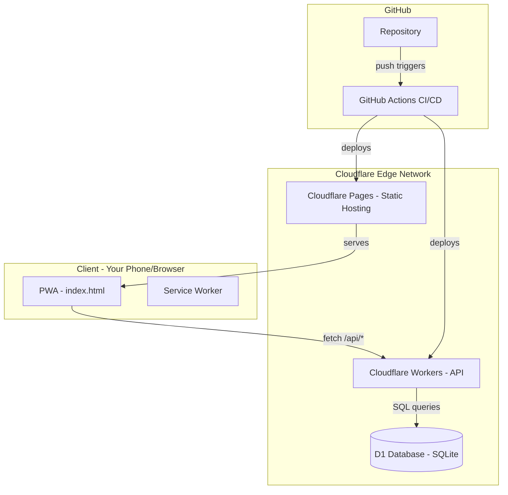
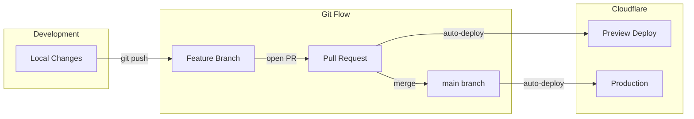

# Cloudflare Backend Setup for ezlineup

## Architecture Overview



---

## Part 1: Backend Setup (Cloudflare Workers + D1)

### 1.1 Project Structure

Reorganize repo to support both frontend and backend:

```
ezlineup/
├── frontend/
│   ├── index.html          # Your current app
│   ├── manifest.json       # PWA manifest (new)
│   └── sw.js               # Service worker (new)
├── api/
│   ├── src/
│   │   ├── index.ts        # Worker entry point
│   │   ├── routes/
│   │   │   ├── games.ts    # Game CRUD endpoints
│   │   │   ├── teams.ts    # Team CRUD endpoints
│   │   │   └── rosters.ts  # Roster endpoints
│   │   └── db/
│   │       └── schema.sql  # D1 schema
│   ├── wrangler.toml       # Cloudflare config
│   ├── package.json
│   └── tsconfig.json
├── package.json            # Root package.json
└── wrangler.toml           # Root config (optional)
```

### 1.2 D1 Database Schema

```sql
-- Teams table
CREATE TABLE teams (
    id TEXT PRIMARY KEY,
    name TEXT NOT NULL,
    sport TEXT NOT NULL,
    league TEXT,
    season TEXT,
    archived INTEGER DEFAULT 0,
    created_at TEXT DEFAULT CURRENT_TIMESTAMP,
    updated_at TEXT DEFAULT CURRENT_TIMESTAMP
);

-- Rosters table
CREATE TABLE rosters (
    id TEXT PRIMARY KEY,
    team_id TEXT NOT NULL,
    player_data TEXT NOT NULL,  -- JSON array of players
    updated_at TEXT DEFAULT CURRENT_TIMESTAMP,
    FOREIGN KEY (team_id) REFERENCES teams(id)
);

-- Games table
CREATE TABLE games (
    id TEXT PRIMARY KEY,
    team_id TEXT NOT NULL,
    name TEXT NOT NULL,
    lineup TEXT,                -- JSON
    metadata TEXT NOT NULL,     -- JSON (opponent, date, scores, etc.)
    created_at TEXT DEFAULT CURRENT_TIMESTAMP,
    updated_at TEXT DEFAULT CURRENT_TIMESTAMP,
    FOREIGN KEY (team_id) REFERENCES teams(id)
);
```

### 1.3 API Endpoints

| Method | Endpoint | Description |

|--------|----------|-------------|

| GET | `/api/teams` | List all teams |

| POST | `/api/teams` | Create team |

| PUT | `/api/teams/:id` | Update team |

| DELETE | `/api/teams/:id` | Delete/archive team |

| GET | `/api/teams/:teamId/games` | List games for team |

| POST | `/api/teams/:teamId/games` | Create game |

| GET | `/api/teams/:teamId/games/:id` | Get single game |

| PUT | `/api/teams/:teamId/games/:id` | Update game |

| DELETE | `/api/teams/:teamId/games/:id` | Delete game |

| GET | `/api/teams/:teamId/roster` | Get roster |

| PUT | `/api/teams/:teamId/roster` | Update roster |

### 1.4 Wrangler Configuration (`api/wrangler.toml`)

```toml
name = "ezlineup-api"
main = "src/index.ts"
compatibility_date = "2024-01-01"

[[d1_databases]]
binding = "DB"
database_name = "ezlineup-db"
database_id = "<will be generated>"
```

---

## Part 2: GitHub Setup

### 2.1 Repository Structure

Your current repo at `/Users/grahamevans/Documents/GitHub/ezlineup` will be restructured. Key files:

- `.github/workflows/deploy.yml` - CI/CD pipeline
- `frontend/` - Static assets deployed to Cloudflare Pages
- `api/` - Worker code deployed separately

### 2.2 GitHub Actions Workflow (`.github/workflows/deploy.yml`)

```yaml
name: Deploy to Cloudflare

on:
  push:
    branches: [main]
  pull_request:
    branches: [main]

jobs:
  deploy:
    runs-on: ubuntu-latest
    steps:
      - uses: actions/checkout@v4
      
      - name: Setup Node.js
        uses: actions/setup-node@v4
        with:
          node-version: '20'
          
      - name: Install dependencies
        run: npm ci
        working-directory: ./api
        
      - name: Deploy Worker
        uses: cloudflare/wrangler-action@v3
        with:
          apiToken: ${{ secrets.CLOUDFLARE_API_TOKEN }}
          workingDirectory: ./api
          
      - name: Deploy Pages
        uses: cloudflare/pages-action@v1
        with:
          apiToken: ${{ secrets.CLOUDFLARE_API_TOKEN }}
          accountId: ${{ secrets.CLOUDFLARE_ACCOUNT_ID }}
          projectName: ezlineup
          directory: ./frontend
```

### 2.3 Required GitHub Secrets

Set these in GitHub repo Settings > Secrets:

- `CLOUDFLARE_API_TOKEN` - Create at Cloudflare dashboard > API Tokens
- `CLOUDFLARE_ACCOUNT_ID` - Found in Cloudflare dashboard URL

---

## Part 3: Development and Deployment Workflow

### 3.1 Initial Setup Commands

```bash
# 1. Install Wrangler CLI globally
npm install -g wrangler

# 2. Login to Cloudflare
wrangler login

# 3. Create the D1 database
wrangler d1 create ezlineup-db

# 4. Apply the schema
wrangler d1 execute ezlineup-db --file=./api/src/db/schema.sql
```

### 3.2 Local Development

```bash
# Terminal 1: Run the API locally with D1
cd api
wrangler dev --local --persist

# Terminal 2: Serve frontend
cd frontend
npx serve . -l 3000
```

Wrangler dev provides:

- Local D1 database (SQLite file)
- Hot reload on code changes
- Same environment as production

### 3.3 Deployment Flow



**Preview Deployments**: Every PR gets a unique preview URL (e.g., `pr-42.ezlineup.pages.dev`)

**Production**: Merging to `main` auto-deploys to production

### 3.4 Manual Deployment (if needed)

```bash
# Deploy API
cd api
wrangler deploy

# Deploy frontend (or use Cloudflare Pages dashboard)
wrangler pages deploy ./frontend --project-name=ezlineup
```

---

## Part 4: Mobile Access (PWA)

To run on your phone, we'll make the app a Progressive Web App:

### 4.1 Add PWA Manifest (`frontend/manifest.json`)

```json
{
  "name": "EZ Lineup",
  "short_name": "EZLineup",
  "start_url": "/",
  "display": "standalone",
  "background_color": "#ffffff",
  "theme_color": "#004E89",
  "icons": [
    { "src": "/icon-192.png", "sizes": "192x192", "type": "image/png" },
    { "src": "/icon-512.png", "sizes": "512x512", "type": "image/png" }
  ]
}
```

### 4.2 Service Worker for Offline Support (`frontend/sw.js`)

Caches the app shell so it works offline, syncs data when back online.

### 4.3 Install on Phone

1. Open the deployed URL in Safari (iOS) or Chrome (Android)
2. iOS: Tap Share > "Add to Home Screen"
3. Android: Tap menu > "Install app" or "Add to Home Screen"

The app will launch fullscreen like a native app.

---

## Part 5: Frontend Changes

Update `StorageService` API methods in `index.html`:

```javascript
async _saveToAPI(gameData) {
    const teamId = TeamService.getCurrentTeamId();
    const response = await fetch(`/api/teams/${teamId}/games`, {
        method: 'POST',
        headers: { 'Content-Type': 'application/json' },
        body: JSON.stringify(gameData)
    });
    return response.json();
}

async _loadFromAPI(gameId) {
    const teamId = TeamService.getCurrentTeamId();
    const response = await fetch(`/api/teams/${teamId}/games/${gameId}`);
    return response.json();
}

// ... similar for other methods
```

Then flip the switch:

```javascript
backend: 'api',  // Change from 'localStorage' to 'api'
```

---

## Cost Estimate (Cloudflare Free Tier)

| Service | Free Tier Limit | Your Expected Usage |

|---------|-----------------|---------------------|

| Workers | 100K requests/day | Well under |

| D1 | 5M rows read, 100K writes/day | Well under |

| Pages | Unlimited sites, bandwidth | Well under |

**Total cost: $0/month** for personal use

---

## Implementation Order

1. Create Cloudflare account and install Wrangler
2. Set up project structure (reorganize files)
3. Create D1 database and apply schema
4. Build Worker API endpoints
5. Update frontend StorageService to use API
6. Add PWA manifest and service worker
7. Set up GitHub Actions for CI/CD
8. Test locally, then deploy
9. Install on phone via "Add to Home Screen"